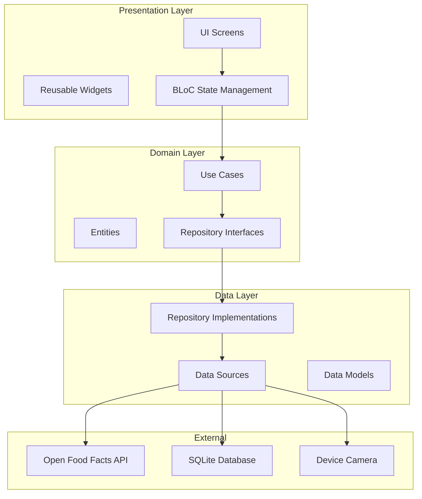
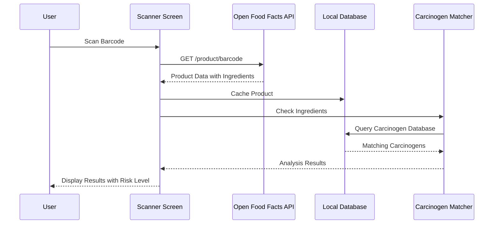
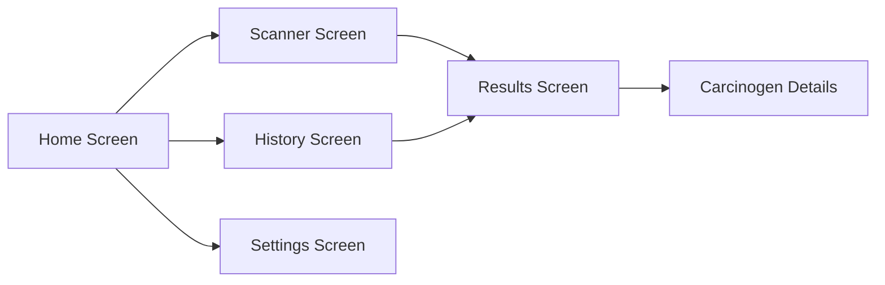

# SafeEats - Food Carcinogen Scanner App

## Overview

SafeEats is a Flutter-based cross-platform mobile application that scans food product barcodes, retrieves ingredient information from Open Food Facts API, and analyzes ingredients for known carcinogens using IARC classifications and California Prop 65 data.

## Tech Stack

| Component | Technology |
|-----------|------------|
| Framework | Flutter 3.x with Dart |
| State Management | flutter_bloc (BLoC pattern) |
| Architecture | Clean Architecture |
| Barcode Scanning | mobile_scanner package |
| HTTP Client | dio |
| Local Database | sqflite / drift |
| Dependency Injection | get_it + injectable |
| Testing | flutter_test, mockito, bloc_test |

## Architecture Diagram



## Project Structure

```
lib/
├── main.dart
├── app.dart
├── injection_container.dart
│
├── core/
│   ├── constants/
│   │   ├── api_constants.dart
│   │   └── app_constants.dart
│   ├── errors/
│   │   ├── exceptions.dart
│   │   └── failures.dart
│   ├── network/
│   │   ├── api_client.dart
│   │   └── network_info.dart
│   ├── theme/
│   │   ├── app_theme.dart
│   │   └── app_colors.dart
│   └── utils/
│       ├── ingredient_parser.dart
│       └── carcinogen_matcher.dart
│
├── features/
│   ├── scanner/
│   │   ├── data/
│   │   │   ├── datasources/
│   │   │   │   └── barcode_scanner_datasource.dart
│   │   │   ├── models/
│   │   │   │   └── barcode_model.dart
│   │   │   └── repositories/
│   │   │       └── scanner_repository_impl.dart
│   │   ├── domain/
│   │   │   ├── entities/
│   │   │   │   └── barcode.dart
│   │   │   ├── repositories/
│   │   │   │   └── scanner_repository.dart
│   │   │   └── usecases/
│   │   │       └── scan_barcode.dart
│   │   └── presentation/
│   │       ├── bloc/
│   │       │   ├── scanner_bloc.dart
│   │       │   ├── scanner_event.dart
│   │       │   └── scanner_state.dart
│   │       ├── pages/
│   │       │   └── scanner_page.dart
│   │       └── widgets/
│   │           └── scanner_overlay.dart
│   │
│   ├── product/
│   │   ├── data/
│   │   │   ├── datasources/
│   │   │   │   ├── product_remote_datasource.dart
│   │   │   │   └── product_local_datasource.dart
│   │   │   ├── models/
│   │   │   │   └── product_model.dart
│   │   │   └── repositories/
│   │   │       └── product_repository_impl.dart
│   │   ├── domain/
│   │   │   ├── entities/
│   │   │   │   ├── product.dart
│   │   │   │   └── ingredient.dart
│   │   │   ├── repositories/
│   │   │   │   └── product_repository.dart
│   │   │   └── usecases/
│   │   │       ├── get_product_by_barcode.dart
│   │   │       └── cache_product.dart
│   │   └── presentation/
│   │       ├── bloc/
│   │       │   ├── product_bloc.dart
│   │       │   ├── product_event.dart
│   │       │   └── product_state.dart
│   │       ├── pages/
│   │       │   └── product_details_page.dart
│   │       └── widgets/
│   │           ├── ingredient_list.dart
│   │           └── product_card.dart
│   │
│   ├── carcinogen/
│   │   ├── data/
│   │   │   ├── datasources/
│   │   │   │   └── carcinogen_local_datasource.dart
│   │   │   ├── models/
│   │   │   │   └── carcinogen_model.dart
│   │   │   └── repositories/
│   │   │       └── carcinogen_repository_impl.dart
│   │   ├── domain/
│   │   │   ├── entities/
│   │   │   │   └── carcinogen.dart
│   │   │   ├── repositories/
│   │   │   │   └── carcinogen_repository.dart
│   │   │   └── usecases/
│   │   │       ├── check_ingredients_for_carcinogens.dart
│   │   │       └── get_carcinogen_details.dart
│   │   └── presentation/
│   │       ├── bloc/
│   │       │   ├── carcinogen_bloc.dart
│   │       │   ├── carcinogen_event.dart
│   │       │   └── carcinogen_state.dart
│   │       ├── pages/
│   │       │   └── carcinogen_details_page.dart
│   │       └── widgets/
│   │           ├── risk_indicator.dart
│   │           └── carcinogen_info_card.dart
│   │
│   └── history/
│       ├── data/
│       │   ├── datasources/
│       │   │   └── history_local_datasource.dart
│       │   ├── models/
│       │   │   └── scan_history_model.dart
│       │   └── repositories/
│       │       └── history_repository_impl.dart
│       ├── domain/
│       │   ├── entities/
│       │   │   └── scan_history.dart
│       │   ├── repositories/
│       │   │   └── history_repository.dart
│       │   └── usecases/
│       │       ├── get_scan_history.dart
│       │       └── save_scan.dart
│       └── presentation/
│           ├── bloc/
│           │   ├── history_bloc.dart
│           │   ├── history_event.dart
│           │   └── history_state.dart
│           ├── pages/
│           │   └── history_page.dart
│           └── widgets/
│               └── history_list_item.dart
│
└── assets/
    ├── data/
    │   ├── iarc_carcinogens.json
    │   └── prop65_carcinogens.json
    └── images/
        └── app_logo.png
```

## Data Flow



## API Integrations

### Open Food Facts API

**Base URL:** `https://world.openfoodfacts.org/api/v2`

**Endpoints:**
- `GET /product/{barcode}` - Get product by barcode

**Response Example:**
```json
{
  "code": "3017620422003",
  "product": {
    "product_name": "Nutella",
    "brands": "Ferrero",
    "ingredients_text": "sugar, palm oil, hazelnuts, cocoa, skim milk, lecithin, vanillin",
    "ingredients": [
      {"id": "en:sugar", "text": "sugar"},
      {"id": "en:palm-oil", "text": "palm oil"}
    ],
    "nutriments": {...},
    "image_url": "..."
  }
}
```

## Carcinogen Database Schema

### IARC Classifications

| Group | Description | Risk Level |
|-------|-------------|------------|
| Group 1 | Carcinogenic to humans | Critical |
| Group 2A | Probably carcinogenic | High |
| Group 2B | Possibly carcinogenic | Medium |
| Group 3 | Not classifiable | Low |

### Database Tables

```sql
CREATE TABLE carcinogens (
    id INTEGER PRIMARY KEY AUTOINCREMENT,
    name TEXT NOT NULL,
    aliases TEXT, -- JSON array of alternative names
    cas_number TEXT,
    source TEXT NOT NULL, -- IARC or PROP65
    classification TEXT,
    risk_level INTEGER, -- 1-4 scale
    description TEXT,
    common_foods TEXT, -- JSON array
    created_at TIMESTAMP DEFAULT CURRENT_TIMESTAMP
);

CREATE TABLE scan_history (
    id INTEGER PRIMARY KEY AUTOINCREMENT,
    barcode TEXT NOT NULL,
    product_name TEXT,
    brand TEXT,
    image_url TEXT,
    ingredients TEXT, -- JSON array
    detected_carcinogens TEXT, -- JSON array
    overall_risk_level INTEGER,
    scanned_at TIMESTAMP DEFAULT CURRENT_TIMESTAMP
);

CREATE TABLE cached_products (
    barcode TEXT PRIMARY KEY,
    product_data TEXT, -- Full JSON response
    cached_at TIMESTAMP DEFAULT CURRENT_TIMESTAMP
);
```

## Key Features

### 1. Barcode Scanner
- Real-time camera preview
- Support for multiple barcode formats (EAN-13, UPC-A, etc.)
- Haptic feedback on successful scan
- Manual barcode entry option

### 2. Ingredient Analysis
- Parse ingredient lists from API
- Normalize ingredient names (remove percentages, parenthetical info)
- Match against carcinogen database using fuzzy matching
- Handle ingredient aliases and synonyms

### 3. Risk Assessment
- Color-coded risk indicators (Green, Yellow, Orange, Red)
- Detailed breakdown by carcinogen source
- Expandable information cards
- Links to scientific sources

### 4. History & Favorites
- Save scan history locally
- Mark products as favorites
- Search and filter history
- Export scan data

### 5. Offline Support
- Cache product data
- Pre-loaded carcinogen database
- Queue scans when offline

## UI Screens

### Screen Flow



### Screen Mockups Description

1. **Home Screen**
   - Large scan button
   - Quick stats (total scans, flagged products)
   - Recent scans carousel
   - Bottom navigation

2. **Scanner Screen**
   - Full-screen camera view
   - Scanning overlay/frame
   - Flash toggle
   - Manual entry button

3. **Results Screen**
   - Product image and name
   - Overall risk badge
   - Ingredient list with highlighted carcinogens
   - Expandable carcinogen cards
   - Share/Save buttons

4. **History Screen**
   - List of past scans
   - Filter by risk level
   - Search functionality
   - Swipe to delete

5. **Settings Screen**
   - Notification preferences
   - Data sources toggle
   - Clear cache option
   - About/Credits

## Dependencies

```yaml
dependencies:
  flutter:
    sdk: flutter
  
  # State Management
  flutter_bloc: ^8.1.3
  equatable: ^2.0.5
  
  # Dependency Injection
  get_it: ^7.6.4
  injectable: ^2.3.2
  
  # Network
  dio: ^5.4.0
  connectivity_plus: ^5.0.2
  
  # Local Storage
  sqflite: ^2.3.0
  shared_preferences: ^2.2.2
  
  # Barcode Scanner
  mobile_scanner: ^3.5.5
  
  # UI
  flutter_svg: ^2.0.9
  cached_network_image: ^3.3.0
  shimmer: ^3.0.0
  lottie: ^2.7.0
  
  # Utils
  dartz: ^0.10.1
  intl: ^0.18.1
  path_provider: ^2.1.1
  permission_handler: ^11.1.0
  
dev_dependencies:
  flutter_test:
    sdk: flutter
  bloc_test: ^9.1.5
  mockito: ^5.4.4
  build_runner: ^2.4.7
  injectable_generator: ^2.4.1
  flutter_lints: ^3.0.1
```

## Risk Level Visualization

| Level | Color | Icon | Description |
|-------|-------|------|-------------|
| Safe | Green (#4CAF50) | ✓ Shield | No known carcinogens detected |
| Low | Yellow (#FFC107) | ⚠ | Contains Group 3 substances |
| Medium | Orange (#FF9800) | ⚠⚠ | Contains Group 2B substances |
| High | Red (#F44336) | ⛔ | Contains Group 1/2A carcinogens |

## Implementation Phases

### Phase 1: Core Setup (Week 1)
- Flutter project initialization
- Clean architecture structure
- Dependency injection setup
- Basic navigation

### Phase 2: Barcode Scanning (Week 1-2)
- Camera integration
- Barcode detection
- Permission handling
- Scanner UI

### Phase 3: Product Lookup (Week 2)
- Open Food Facts API integration
- Product data models
- Caching layer
- Error handling

### Phase 4: Carcinogen Database (Week 2-3)
- Import IARC data
- Import Prop 65 data
- Database setup
- Query optimization

### Phase 5: Analysis Engine (Week 3)
- Ingredient parsing
- Fuzzy matching algorithm
- Risk calculation
- Results aggregation

### Phase 6: UI/UX (Week 3-4)
- All screen implementations
- Animations
- Responsive design
- Accessibility

### Phase 7: Polish & Testing (Week 4)
- Unit tests
- Widget tests
- Integration tests
- Performance optimization

## Security Considerations

1. **API Keys**: Store securely, don't commit to repo
2. **User Data**: All data stored locally, no cloud sync
3. **Permissions**: Request only camera permission
4. **Privacy**: No analytics or tracking

## Future Enhancements

1. iOS deployment
2. Allergen detection
3. Nutritional scoring (Nutri-Score)
4. Barcode history sharing
5. Community contributions to carcinogen database
6. Push notifications for product recalls
7. Multi-language support