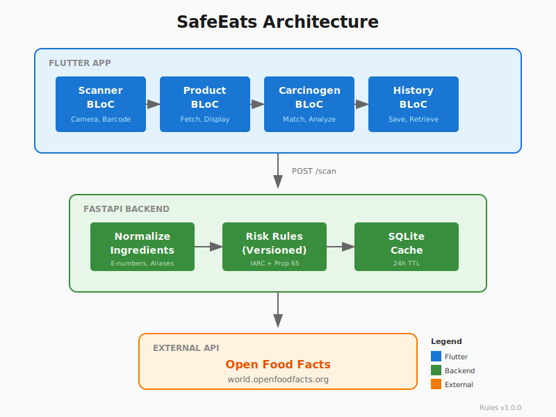

# SafeEats 🍎

[](https://github.com/your-username/SafeEats/actions/workflows/ci.yml)


A Flutter application that scans food product barcodes, retrieves ingredient information from Open Food Facts, and checks for potential carcinogens using IARC and California Prop 65 databases.



## Screenshots

<p align="center">
  
  
  
  
</p>

### Capturing Screenshots

To add your own screenshots:

```bash
# Create screenshots directory
mkdir -p screenshots

# Run app in emulator/simulator, then capture:
# iOS Simulator: Cmd+S
# Android Emulator: Click camera icon in toolbar
# macOS: Cmd+Shift+5

# Required screenshots:
# - home.png: Home screen with scan button
# - scan.png: Camera/scanning view
# - results.png: Product analysis results
# - database.png: Carcinogen database list
```

> **Tip**: Use a device with a 1080px width for consistent sizing. Screenshots should show real data from scanning actual products.

## What This Is / What This Is Not

### ✅ What SafeEats Is

- **An educational tool** for food ingredient awareness
- **A quick reference** to identify potentially concerning ingredients in food products
- **Based on peer-reviewed data** from IARC (International Agency for Research on Cancer) classifications and California Proposition 65 lists
- **A personal project** demonstrating Clean Architecture, BLoC pattern, and Flutter best practices

### ❌ What SafeEats Is Not

- **Not a substitute** for professional medical or dietary advice
- **Not a definitive health assessment tool** — many factors affect health beyond ingredient presence
- **Not 100% comprehensive** — new research and ingredients are continuously being studied
- **Not a diagnostic tool** — the presence of an ingredient does not mean a product will cause harm

> **Important**: Always consult healthcare professionals for medical concerns. This app is for informational and educational purposes only.

## Features

- **Barcode Scanning**: Scan food product barcodes using your device's camera
- **Ingredient Analysis**: Retrieve and parse ingredient lists from Open Food Facts API
- **Carcinogen Detection**: Check ingredients against IARC classifications and California Prop 65 list
- **Risk Level Assessment**: Visual risk indicators from Safe to Critical based on scientific classifications
- **Scan History**: Keep track of previously scanned products
- **Offline Support**: Local caching of product data and carcinogen database
- **Searchable Database**: Browse and search the complete carcinogen database

## Quick Start

### One-Command Setup (Recommended)

```bash
# Make the script executable (first time only)
chmod +x run.sh

# Start backend + Flutter app
./run.sh
```

This will:
1. Check prerequisites (Python 3, Flutter)
2. Set up and start the backend API
3. Install Flutter dependencies
4. Launch the Flutter app

### Manual Setup

#### Backend

```bash
cd backend
python3 -m venv venv
source venv/bin/activate  # On Windows: venv\Scripts\activate
pip install -r requirements.txt
uvicorn app:app --reload --port 8000
```

The API will be available at http://localhost:8000 (Swagger docs at http://localhost:8000/docs)

#### Flutter App

```bash
flutter pub get
flutter run
```

### Running Tests

```bash
# Backend tests
cd backend
pip install -r requirements.txt
pytest tests/ -v

# Flutter tests
flutter test
```

## Architecture

This project uses a **client-server architecture** with Clean Architecture principles and a **resilient dual data source strategy**:

```
┌─────────────────────────────────────────────────────────────────────┐
│                       SafeEats Flutter App                           │
│  ┌───────────┐  ┌───────────┐  ┌───────────┐  ┌───────────┐        │
│  │  Scanner  │→ │  Product  │→ │ Carcinogen│→ │  History  │        │
│  │   BLoC    │  │   BLoC    │  │    BLoC   │  │   BLoC    │        │
│  └───────────┘  └───────────┘  └───────────┘  └───────────┘        │
│                        │                                             │
│  ┌─────────────────────┴─────────────────────────────────────────┐  │
│  │                   ProductRepositoryImpl                        │  │
│  │  ┌─────────────────┐  ┌─────────────────┐  ┌──────────────┐   │  │
│  │  │ BackendDataSrc  │→ │ RemoteDataSrc   │→ │ LocalDataSrc │   │  │
│  │  │   (primary)     │  │   (fallback)    │  │   (cache)    │   │  │
│  │  └────────┬────────┘  └────────┬────────┘  └──────────────┘   │  │
│  └───────────│────────────────────│───────────────────────────────┘  │
└──────────────│────────────────────│──────────────────────────────────┘
               │ POST /scan         │ GET /product
               ▼                    ▼
┌──────────────────────────┐  ┌────────────────────────────────────────┐
│    SafeEats Backend      │  │        Open Food Facts API             │
│       (FastAPI)          │  │    world.openfoodfacts.org/api/v2      │
│  ┌────────────────────┐  │  └────────────────────────────────────────┘
│  │ Normalize → Rules  │  │             ▲
│  │      ↓             │  │             │
│  │ Risk Classification│──│─────────────┘ (Backend also fetches from OFF)
│  │      ↓             │  │
│  │ SQLite Cache       │  │
│  │ (decisions cached) │  │
│  └────────────────────┘  │
└──────────────────────────┘
```

### Data Flow Priority

1. **Check Local Cache** → Return immediately if cached
2. **Try Backend (Primary)** → Normalized ingredients + Risk classification + Versioned rules
3. **Fallback to Open Food Facts** → Direct API call if backend unavailable
4. **Cache Result** → Store for offline access

### Project Structure

```
├── backend/                      # FastAPI backend
│   ├── app.py                   # Main API application
│   ├── rules.py                 # Risk classification rules (v1.0.0)
│   ├── db.py                    # SQLite cache operations
│   ├── data/ingredient_map.json # Ingredient normalization map
│   └── tests/                   # Backend tests (52 tests)
│
├── lib/                          # Flutter app
│   ├── core/                    # Shared utilities, network, theme
│   │   ├── network/api_client.dart        # HTTP client wrapper
│   │   ├── errors/exceptions.dart         # Custom exceptions
│   │   └── errors/failures.dart           # Failure types
│   ├── features/                # Feature modules
│   │   ├── product/data/datasources/
│   │   │   ├── product_backend_datasource.dart  # Backend API (primary)
│   │   │   ├── product_remote_datasource.dart   # OFF API (fallback)
│   │   │   └── product_local_datasource.dart    # SQLite cache
│   │   └── ...
│   ├── app.dart                 # MaterialApp configuration
│   ├── injection_container.dart # Dependency injection (GetIt)
│   └── main.dart                # App entry point
│
├── docs/                         # Documentation
│   ├── diagrams/                # Mermaid architecture diagrams
│   ├── RISK_MODEL.md            # Risk classification documentation
│   ├── DATA_SOURCES.md          # Data sources and limitations
│   ├── OFFLINE_MODE.md          # Offline capabilities
│   └── TROUBLESHOOTING_LOG.md   # Issues and resolutions
│
├── test/                         # Flutter tests (157 tests)
│   ├── features/                # Feature tests
│   ├── core/                    # Core utility tests
│   └── integration/             # Integration tests
│
└── .github/workflows/ci.yml      # GitHub Actions CI
```

Each Flutter feature follows a three-layer architecture:
- **Presentation**: BLoC, Pages, Widgets
- **Domain**: Entities, Repositories (abstract), Use Cases
- **Data**: Models, Data Sources, Repository Implementations

### Dual API Client Architecture

The app uses **named Dio instances** for different backends:

```dart
// SafeEats Backend (primary) - http://localhost:8000
sl.registerLazySingleton<Dio>(() => Dio(BaseOptions(
  baseUrl: backendUrl,
)), instanceName: 'backend');

// Open Food Facts (fallback) - https://world.openfoodfacts.org/api/v2
sl.registerLazySingleton<Dio>(() => Dio(BaseOptions(
  baseUrl: 'https://world.openfoodfacts.org/api/v2',
)), instanceName: 'openFoodFacts');
```

## Why a Backend?

Even though the Flutter app has offline capabilities, the backend exists for important reasons:

1. **Single Source of Truth**: Risk classification rules are versioned and maintained in one place
2. **Consistency**: All app instances get the same risk assessment for the same product
3. **Updateability**: Rules can be updated server-side without requiring app store releases
4. **Reduced Client Complexity**: Ingredient normalization and matching logic is centralized
5. **Transparency**: Each risk decision includes source attribution (IARC Group, Prop 65, etc.)
6. **Future-Proofing**: Enables cross-device sync, user accounts, and analytics in the future

The Flutter app maintains offline fallback logic for when the backend is unavailable.

## Why Flutter + BLoC?

**Flutter** was chosen for this project because it enables rapid cross-platform development with a single codebase, delivering native performance on both iOS and Android. Its declarative UI framework makes it ideal for building reactive interfaces that respond to state changes—perfect for a scanning app where results need to update in real-time.

**BLoC (Business Logic Component)** was selected as the state management solution because it enforces a clear separation between UI and business logic, making the code highly testable and maintainable. BLoC's event-driven architecture aligns naturally with user actions (scan barcode → fetch product → check carcinogens → display results), and its stream-based approach makes handling async operations like API calls and database queries clean and predictable. The strict unidirectional data flow (Events → BLoC → States) also makes debugging straightforward—every state change is traceable to a specific event.

## Risk Classification

SafeEats uses a deterministic, versioned rule-based system. See [docs/RISK_MODEL.md](docs/RISK_MODEL.md) for complete documentation.

### Risk Levels

| Level | Color | Description |
|-------|-------|-------------|
| Safe | Green | No known carcinogens detected |
| Low | Lime | Minor concerns with limited evidence |
| Medium | Amber | Possible carcinogen (IARC Group 2B) |
| High | Orange | Probable carcinogen (IARC Group 2A) |
| Critical | Red | Known carcinogen (IARC Group 1) |

### Source Priority

When multiple sources classify an ingredient differently:
```
IARC Group 1 > IARC Group 2A > IARC Group 2B > Prop 65 > IARC Group 3
```

## Data Sources

See [docs/DATA_SOURCES.md](docs/DATA_SOURCES.md) for detailed information and limitations.

### Open Food Facts API
- Free, open-source food product database
- Provides ingredient lists, nutrition info, and product details
- https://world.openfoodfacts.org

### IARC Classifications
International Agency for Research on Cancer classifications:
- **Group 1**: Carcinogenic to humans
- **Group 2A**: Probably carcinogenic to humans
- **Group 2B**: Possibly carcinogenic to humans
- **Group 3**: Not classifiable

### California Proposition 65
- Safe Drinking Water and Toxic Enforcement Act
- List of 900+ chemicals known to cause cancer or reproductive harm

## Prerequisites

- **Flutter SDK** 3.0 or higher
- **Python** 3.10 or higher
- **pip** (Python package manager)
- Android device/emulator or iOS device/simulator with camera

## Dependencies

### Flutter

| Package | Purpose |
|---------|---------|
| flutter_bloc | State management |
| get_it | Dependency injection |
| dartz | Functional programming (Either type) |
| dio | HTTP client |
| sqflite | Local SQLite database |
| mobile_scanner | Barcode scanning |
| connectivity_plus | Network connectivity |
| equatable | Value equality |

### Backend

| Package | Purpose |
|---------|---------|
| FastAPI | Web framework |
| uvicorn | ASGI server |
| httpx | Async HTTP client |
| pydantic | Data validation |
| pytest | Testing framework |

## API Reference

### Backend Endpoints

| Method | Endpoint | Description | Response Codes |
|--------|----------|-------------|----------------|
| POST | `/scan` | Scan a barcode and get risk analysis | 200, 400, 404, 422, 502 |
| GET | `/health` | Health check with rules version | 200 |
| GET | `/rules/metadata` | Risk classification metadata | 200 |

#### POST /scan Example

```bash
curl -X POST http://localhost:8000/scan \
  -H "Content-Type: application/json" \
  -d '{"barcode": "3017620422003"}'
```

**Response:**
```json
{
  "product_name": "Nutella",
  "brand": "Ferrero",
  "raw_ingredients": ["sugar", "palm oil", "hazelnuts", "..."],
  "normalized_ingredients": ["sugar", "palm oil", "hazelnut", "..."],
  "ingredient_risks": [
    {
      "ingredient": "palm oil",
      "normalized_name": "palm oil",
      "risk": "moderate",
      "source": "PROP65",
      "classification": "Possible Concern"
    }
  ],
  "overall_risk": "moderate",
  "rules_version": "1.0.0"
}
```

See [backend/README.md](backend/README.md) for detailed API documentation.

### Environment Variables

| Variable | Default | Description |
|----------|---------|-------------|
| `BACKEND_URL` | `http://localhost:8000` | Backend API URL (Flutter) |
| `TESTING` | - | Set to "1" for test mode (Backend) |

```bash
# Run Flutter with custom backend
flutter run --dart-define=BACKEND_URL=https://api.safeeats.example.com
```

## Testing

### Test Summary

| Component | Tests | Status |
|-----------|-------|--------|
| Flutter | 157 | ✅ Passing |
| Backend | 52 | ✅ Passing |
| **Total** | **209** | ✅ **All Passing** |

### Backend Tests (52 tests)

```bash
cd backend
pytest tests/ -v

# With coverage
pytest tests/ --cov=. --cov-report=html

# Run specific test file
pytest tests/test_rules.py -v
```

**Test Categories:**
- Risk Classification (24 tests)
- API Endpoints (14 tests)
- Ingredient Normalization (6 tests)
- Versioning (4 tests)
- Conflict Resolution (4 tests)

### Flutter Tests (157 tests)

```bash
# All tests
flutter test

# Specific feature
flutter test test/features/product/

# Widget tests only
flutter test test/features/product/presentation/widgets/

# With coverage
flutter test --coverage
genhtml coverage/lcov.info -o coverage/html
```

**Test Categories:**
- BLoC Tests: ProductBloc, ScannerBloc, HistoryBloc
- Widget Tests: RiskIndicator, CarcinogenCard
- DataSource Tests: Remote, Local, Backend
- Integration Tests: Scan-to-Results flow

## Permissions

| Permission | Purpose |
|------------|---------|
| CAMERA | Scanning product barcodes |
| INTERNET | Fetching product data |

## Privacy

- All scan history is stored locally on your device
- No personal data is collected or transmitted
- Product lookups are made anonymously to Open Food Facts API

## Project Documentation

- [Architecture Details](ARCHITECTURE.md) - Deep dive into system design
- [Architecture Diagrams](docs/diagrams/README.md) - Sequence, class, flow, and state diagrams
- [Risk Model](docs/RISK_MODEL.md) - How risk classification works
- [Data Sources](docs/DATA_SOURCES.md) - Sources, accuracy, and limitations
- [Offline Mode](docs/OFFLINE_MODE.md) - Caching strategy and offline support
- [Troubleshooting Log](docs/TROUBLESHOOTING_LOG.md) - Issues encountered and resolutions
- [Backend API](backend/README.md) - API documentation and setup

## Disclaimer

This application is provided for **informational and educational purposes only**.

- Not a substitute for professional medical advice
- Database accuracy cannot be guaranteed
- Many factors affect cancer risk beyond ingredient presence
- Always consult healthcare professionals for medical concerns

## Contributing

Contributions are welcome! Please:

1. Fork the repository
2. Create a feature branch
3. Add tests for new functionality
4. Submit a pull request

## License

This project is licensed under the MIT License - see the LICENSE file for details.

## Acknowledgments

- [Open Food Facts](https://world.openfoodfacts.org) for the product database
- [IARC](https://monographs.iarc.who.int) for carcinogen classifications
- [California OEHHA](https://oehha.ca.gov/proposition-65) for Prop 65 data