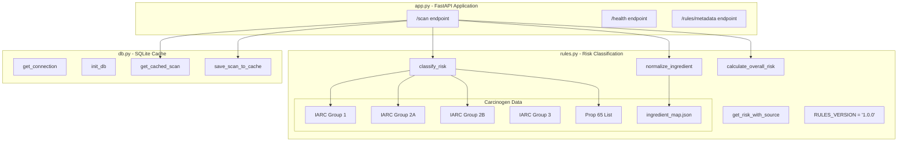
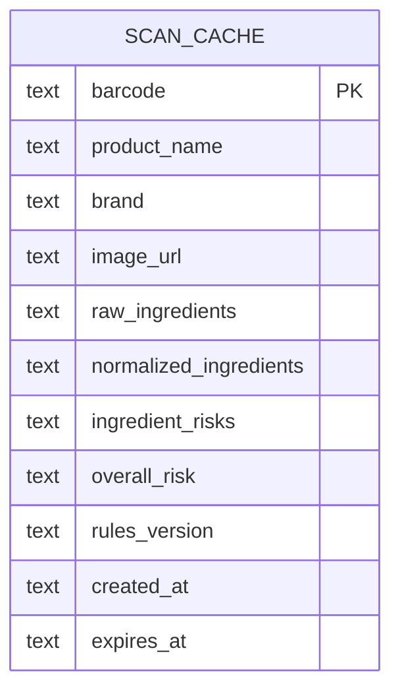
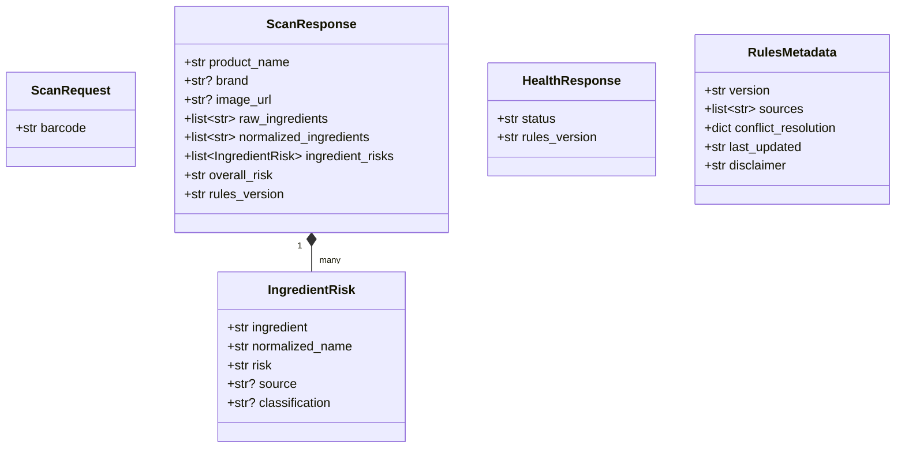
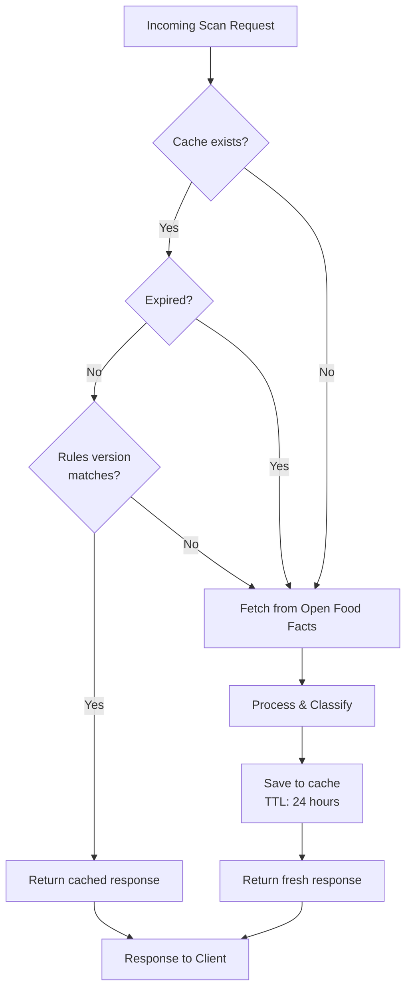
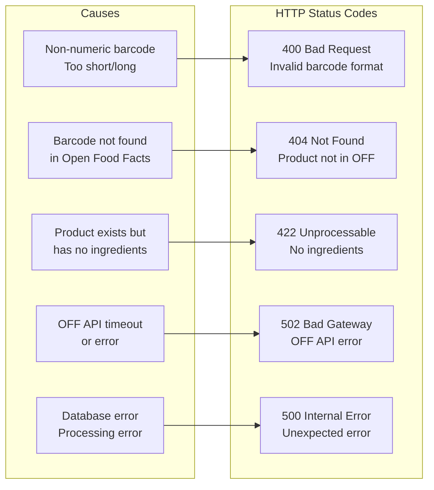
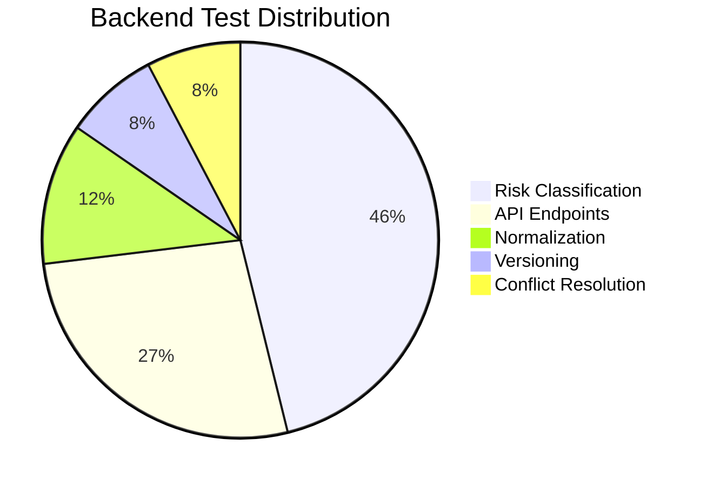

# Backend Architecture Diagrams

This document contains diagrams specific to the SafeEats FastAPI backend.

## API Endpoint Flow

```mermaid
sequenceDiagram
    participant Client as Flutter App
    participant API as FastAPI
    participant Cache as SQLite Cache
    participant Rules as Risk Rules Engine
    participant OFF as Open Food Facts
    
    Client->>API: POST /scan {barcode}
    
    API->>API: Validate barcode format
    
    alt Invalid Barcode
        API-->>Client: 400 Bad Request
    end
    
    API->>Cache: Check cache for barcode
    
    alt Cache Hit
        Cache-->>API: Cached response
        API-->>Client: 200 OK (cached)
    else Cache Miss
        API->>OFF: GET /product/{barcode}
        
        alt Product Not Found
            OFF-->>API: 404
            API-->>Client: 404 Not Found
        else Product Found
            OFF-->>API: Product data
            
            API->>API: Parse ingredients
            
            alt No Ingredients
                API-->>Client: 422 No Ingredients
            end
            
            API->>Rules: Normalize ingredients
            Rules-->>API: Normalized list
            
            API->>Rules: Classify each ingredient
            Rules-->>API: Risk assessments
            
            API->>Rules: Calculate overall risk
            Rules-->>API: Overall risk level
            
            API->>Cache: Store decision
            
            API-->>Client: 200 OK (ScanResponse)
        end
    end
```

## Backend Module Structure



## Database Schema



## Response Models



## Caching Strategy



## Error Handling



## Test Coverage



| Test Category | Count | Description |
|---------------|-------|-------------|
| Risk Classification | 24 | Single ingredient, multiple sources, edge cases |
| API Endpoints | 14 | /scan, /health, /rules/metadata responses |
| Normalization | 6 | Case handling, punctuation, synonyms |
| Versioning | 4 | Version format, metadata completeness |
| Conflict Resolution | 4 | Source priority, deterministic results |