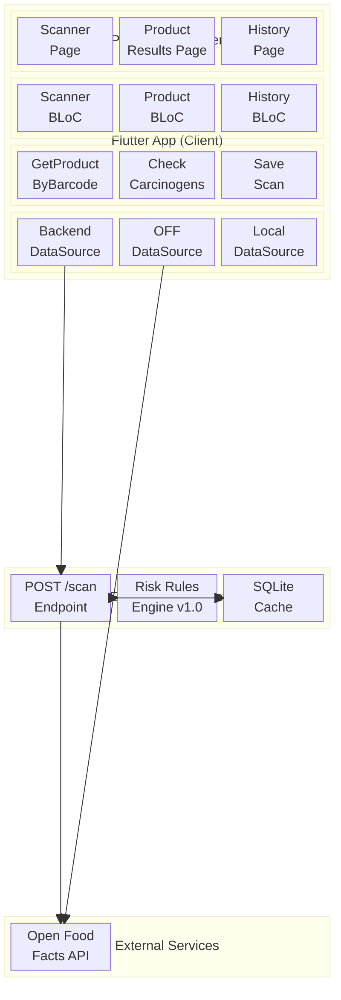
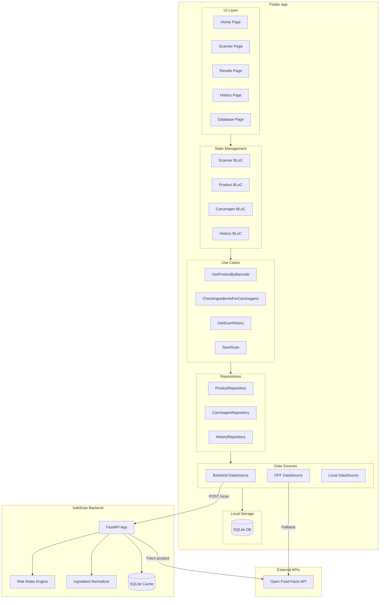

# Block Diagram: System Architecture

This diagram shows the overall system architecture of SafeEats.

## Alternative View: Component Relationships

## Layer Responsibilities

| Layer | Components | Responsibility |
|-------|------------|----------------|
| **UI** | Pages, Widgets | User interaction, display |
| **BLoC** | ScannerBloc, ProductBloc, etc. | State management, business logic orchestration |
| **Use Cases** | GetProductByBarcode, SaveScan, etc. | Single-purpose business operations |
| **Repository** | ProductRepository, HistoryRepository | Data access abstraction |
| **Data Source** | BackendDS, LocalDS, RemoteDS | Concrete data fetching |
| **Backend** | FastAPI, Rules Engine | Centralized processing, risk classification |