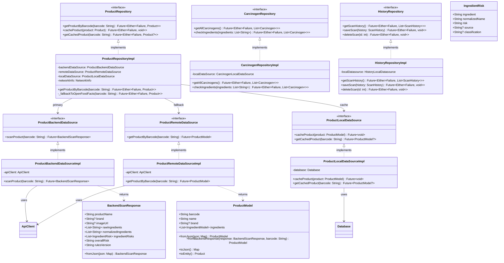
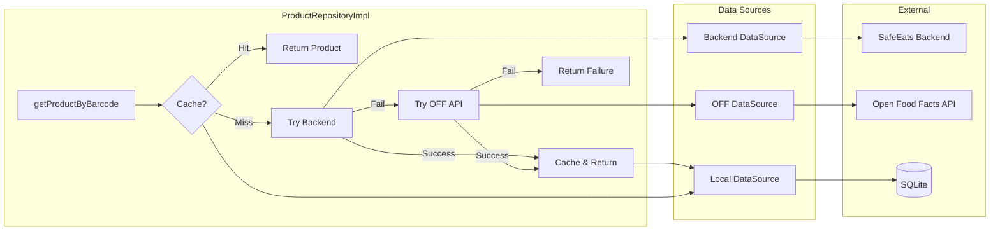
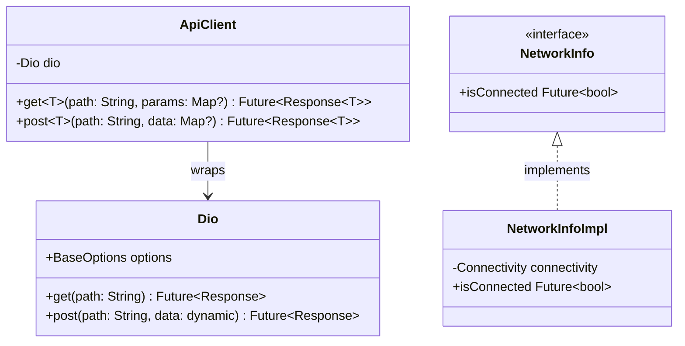

# Class Diagram: Data Layer

This diagram shows the data layer architecture including repositories, data sources, and models.



## Data Flow Diagram



## API Client Architecture



## Dependency Injection Setup

```dart
// Two API clients for different backends
sl.registerLazySingleton<Dio>(() => Dio(BaseOptions(
  baseUrl: backendUrl,  // SafeEats backend
)), instanceName: 'backend');

sl.registerLazySingleton<Dio>(() => Dio(BaseOptions(
  baseUrl: 'https://world.openfoodfacts.org/api/v2',
)), instanceName: 'openFoodFacts');

// Data sources use specific API clients
sl.registerLazySingleton<ProductBackendDataSource>(
  () => ProductBackendDataSourceImpl(
    apiClient: sl<ApiClient>(instanceName: 'backend'),
  ),
);

sl.registerLazySingleton<ProductRemoteDataSource>(
  () => ProductRemoteDataSourceImpl(
    apiClient: sl<ApiClient>(instanceName: 'openFoodFacts'),
  ),
);