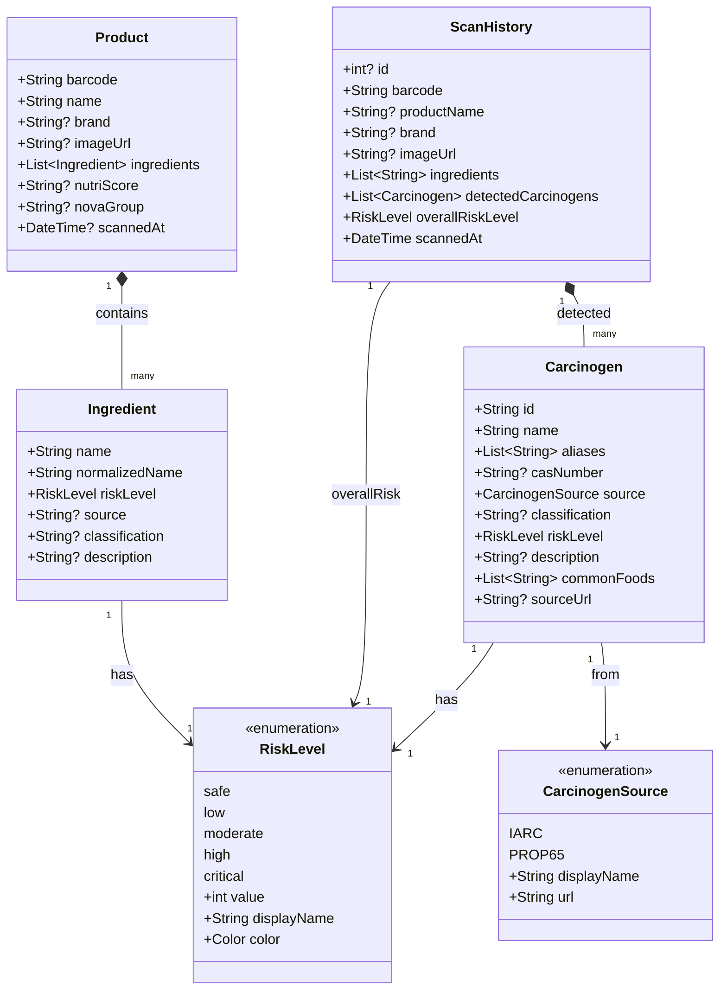

# Class Diagram: Domain Entities

This diagram shows the core domain entities and their relationships.



## Entity Descriptions

### Product
The main entity representing a food product scanned by the user.

| Field | Type | Description |
|-------|------|-------------|
| barcode | String | Product barcode (EAN-13, UPC-A, etc.) |
| name | String | Product name |
| brand | String? | Brand name |
| imageUrl | String? | Product image URL |
| ingredients | List\<Ingredient\> | Parsed ingredients list |
| nutriScore | String? | Nutri-Score grade (A-E) |
| novaGroup | String? | NOVA food processing classification |

### Ingredient
Represents a single ingredient with risk assessment.

| Field | Type | Description |
|-------|------|-------------|
| name | String | Original ingredient name |
| normalizedName | String | Cleaned, lowercase name |
| riskLevel | RiskLevel | Assessed risk level |
| source | String? | Data source (IARC, Prop 65) |
| classification | String? | Specific classification (Group 1, 2A, etc.) |

### Carcinogen
Known carcinogenic or potentially harmful substance.

| Field | Type | Description |
|-------|------|-------------|
| id | String | Unique identifier |
| name | String | Primary name |
| aliases | List\<String\> | Alternative names |
| casNumber | String? | CAS Registry Number |
| source | CarcinogenSource | Data source |
| classification | String? | Risk classification |
| riskLevel | RiskLevel | Risk level |
| commonFoods | List\<String\> | Foods where commonly found |

### ScanHistory
Record of a product scan for history tracking.

| Field | Type | Description |
|-------|------|-------------|
| id | int? | Database ID |
| barcode | String | Scanned barcode |
| productName | String? | Product name at scan time |
| detectedCarcinogens | List\<Carcinogen\> | Carcinogens found |
| overallRiskLevel | RiskLevel | Highest risk detected |
| scannedAt | DateTime | Scan timestamp |

## Risk Level Values

```dart
enum RiskLevel {
  safe(0, 'Safe', Colors.green),
  low(1, 'Low', Colors.lightGreen),
  moderate(2, 'Moderate', Colors.amber),
  high(3, 'High', Colors.orange),
  critical(4, 'Critical', Colors.red);

  final int value;
  final String displayName;
  final Color color;

  const RiskLevel(this.value, this.displayName, this.color);
}