# Flow Diagram: Risk Classification

This diagram shows how ingredients are classified into risk levels.

```mermaid
flowchart TD
    Start([Ingredient Input]) --> Normalize
    
    Normalize[Normalize Ingredient Name<br/>lowercase, trim, remove extras]
    Normalize --> CheckDB
    
    CheckDB{Found in<br/>Known Carcinogens?}
    
    CheckDB -->|No| Safe[🟢 SAFE<br/>Risk Level: 0]
    CheckDB -->|Yes| GetSource
    
    GetSource[Get Source & Classification]
    GetSource --> CheckSource
    
    CheckSource{Source Type?}
    
    CheckSource -->|IARC| CheckIARC
    CheckSource -->|Prop 65| CheckProp65
    
    subgraph IARC["IARC Classification"]
        CheckIARC{IARC Group?}
        CheckIARC -->|Group 1| Critical[🔴 CRITICAL<br/>Known Carcinogen<br/>Risk Level: 4]
        CheckIARC -->|Group 2A| High[🟠 HIGH<br/>Probable Carcinogen<br/>Risk Level: 3]
        CheckIARC -->|Group 2B| Moderate[🟡 MODERATE<br/>Possible Carcinogen<br/>Risk Level: 2]
        CheckIARC -->|Group 3| Low[🟢 LOW<br/>Not Classifiable<br/>Risk Level: 1]
    end
    
    subgraph Prop65["Prop 65 Classification"]
        CheckProp65{Classification?}
        CheckProp65 -->|Known Carcinogen| HighP[🟠 HIGH<br/>Risk Level: 3]
        CheckProp65 -->|Reproductive Toxicant| ModerateP[🟡 MODERATE<br/>Risk Level: 2]
        CheckProp65 -->|Other| LowP[🟢 LOW<br/>Risk Level: 1]
    end
    
    Critical --> Aggregate
    High --> Aggregate
    Moderate --> Aggregate
    Low --> Aggregate
    HighP --> Aggregate
    ModerateP --> Aggregate
    LowP --> Aggregate
    Safe --> Aggregate
    
    Aggregate[Aggregate All Ingredient Risks]
    Aggregate --> Overall
    
    Overall[Overall Product Risk =<br/>MAX of all ingredient risks]
    Overall --> Result([Return Risk Assessment])
```



## Conflict Resolution Flow

When an ingredient appears in multiple sources with different classifications:

```mermaid
flowchart TD
    Input([Ingredient Found in<br/>Multiple Sources]) --> Compare
    
    Compare[Compare Classifications]
    Compare --> Priority
    
    Priority{Apply Priority Order}
    
    Priority --> P1[1️⃣ IARC Group 1<br/>Highest Priority]
    Priority --> P2[2️⃣ IARC Group 2A]
    Priority --> P3[3️⃣ IARC Group 2B]
    Priority --> P4[4️⃣ Prop 65]
    Priority --> P5[5️⃣ IARC Group 3<br/>Lowest Priority]
    
    P1 --> Select
    P2 --> Select
    P3 --> Select
    P4 --> Select
    P5 --> Select
    
    Select[Select Highest Priority<br/>Classification]
    Select --> Result([Return Single<br/>Risk Assessment])
```



## Risk Level Summary

| Level | Value | Color | IARC Mapping | Prop 65 Mapping |
|-------|-------|-------|--------------|-----------------|
| Safe | 0 | 🟢 Green | Not found | Not found |
| Low | 1 | 🟢 Lime | Group 3 | Minor concerns |
| Moderate | 2 | 🟡 Amber | Group 2B | Reproductive toxicant |
| High | 3 | 🟠 Orange | Group 2A | Known carcinogen |
| Critical | 4 | 🔴 Red | Group 1 | - |

## Backend Implementation

```python
# From rules.py

def classify_risk(ingredient: str) -> str:
    """Classify single ingredient risk."""
    normalized = normalize_ingredient(ingredient)
    
    # Check IARC first (higher authority)
    if normalized in IARC_GROUP_1:
        return "critical"
    elif normalized in IARC_GROUP_2A:
        return "high"
    elif normalized in IARC_GROUP_2B:
        return "moderate"
    
    # Check Prop 65
    if normalized in PROP_65_CARCINOGENS:
        return "high"
    elif normalized in PROP_65_REPRODUCTIVE:
        return "moderate"
    
    # Check IARC Group 3 (lowest priority)
    if normalized in IARC_GROUP_3:
        return "low"
    
    return "safe"

def calculate_overall_risk(risks: list[str]) -> str:
    """Return highest risk level from list."""
    priority = ["critical", "high", "moderate", "low", "safe"]
    for level in priority:
        if level in risks:
            return level
    return "safe"