# SafeEats Project Flow & Sequence Diagrams

A comprehensive collection of all application flows and architecture diagrams.

---

## 1. High-Level Application Flow

Shows the complete user journey through the app.


---

## 2. Complete System Architecture

End-to-end architecture showing all components.


---

## 3. Barcode Scanning Sequence (Detailed)

Complete flow from user scan to displaying results.


---

## 4. Risk Classification Flow

How ingredients are classified into risk levels.

```mermaid
flowchart TD
    Input([📥 Ingredient List]) --> Parse
    
    Parse[Parse ingredients from text]
    Parse --> Loop
    
    Loop{For each ingredient}
    Loop --> Normalize
    
    Normalize[🔧 Normalize Name<br/>• lowercase<br/>• trim whitespace<br/>• remove percentages<br/>• resolve aliases]
    Normalize --> CheckIARC
    
    CheckIARC{Check IARC Database}
    
    CheckIARC -->|Group 1| Critical[🔴 CRITICAL<br/>Carcinogenic to humans]
    CheckIARC -->|Group 2A| High[🟠 HIGH<br/>Probably carcinogenic]
    CheckIARC -->|Group 2B| Moderate[🟡 MODERATE<br/>Possibly carcinogenic]
    CheckIARC -->|Group 3| Low[🟢 LOW<br/>Not classifiable]
    CheckIARC -->|Not Found| CheckProp65
    
    CheckProp65{Check Prop 65}
    CheckProp65 -->|Known Carcinogen| High
    CheckProp65 -->|Reproductive Toxicant| Moderate
    CheckProp65 -->|Not Found| Safe[✅ SAFE<br/>No known concerns]
    
    Critical --> Aggregate
    High --> Aggregate
    Moderate --> Aggregate
    Low --> Aggregate
    Safe --> Aggregate
    
    Aggregate[📊 Aggregate All Risks]
    Aggregate --> Overall
    
    Overall[🎯 Overall Risk = MAX<br/>of all ingredient risks]
    Overall --> Result([📤 Return Assessment])
```



---

## 5. BLoC State Machine

State transitions for ProductBloc.


---

## 6. Data Layer Flow

How data moves through repositories and data sources.


---

## 7. Offline Mode Flow

How the app handles offline scenarios.


---

## 8. API Request/Response Flow

Backend endpoint processing.

```mermaid
sequenceDiagram
    participant Client as Flutter App
    participant API as FastAPI
    participant Val as Validator
    participant Cache as SQLite Cache
    participant Rules as Rules Engine
    participant OFF as Open Food Facts
    
    Client->>API: POST /scan {"barcode": "123456"}
    
    API->>Val: Validate barcode format
    
    alt Invalid Format
        Val-->>API: ValidationError
        API-->>Client: 400 Bad Request
    end
    
    API->>Cache: get_cached_scan(barcode)
    
    alt Cache Hit & Valid
        Cache-->>API: Cached ScanResponse
        API-->>Client: 200 OK (from cache)
    else Cache Miss
        API->>OFF: GET /api/v2/product/{barcode}
        
        alt Product Not Found
            OFF-->>API: 404
            API-->>Client: 404 Not Found
        else Product Found
            OFF-->>API: Product Data
            
            API->>Rules: normalize_ingredients(raw_list)
            Rules-->>API: normalized_list
            
            loop For each ingredient
                API->>Rules: classify_risk(ingredient)
                Rules-->>API: risk_assessment
            end
            
            API->>Rules: calculate_overall_risk(all_risks)
            Rules-->>API: overall_risk
            
            API->>Cache: save_scan(barcode, response)
            
            API-->>Client: 200 OK (ScanResponse)
        end
    end
```

---

## 9. Entity Relationship Diagram

Core domain entities and their relationships.


---

## 10. Feature Module Structure

Clean Architecture implementation per feature.


---

## Quick Reference

| Diagram | Purpose |
|---------|---------|
| [#1 Application Flow](#1-high-level-application-flow) | User journey through screens |
| [#2 System Architecture](#2-complete-system-architecture) | All components and their connections |
| [#3 Scan Sequence](#3-barcode-scanning-sequence-detailed) | Detailed scan-to-result flow |
| [#4 Risk Classification](#4-risk-classification-flow) | How risks are determined |
| [#5 BLoC States](#5-bloc-state-machine) | State transitions in ProductBloc |
| [#6 Data Layer](#6-data-layer-flow) | Repository pattern implementation |
| [#7 Offline Mode](#7-offline-mode-flow) | Offline handling strategy |
| [#8 API Flow](#8-api-requestresponse-flow) | Backend endpoint processing |
| [#9 ERD](#9-entity-relationship-diagram) | Domain entity relationships |
| [#10 Feature Structure](#10-feature-module-structure) | Clean Architecture per feature |

---

## Viewing These Diagrams

1. **GitHub**: Renders Mermaid automatically
2. **VS Code**: Install "Markdown Preview Mermaid Support" extension
3. **Online**: Paste code at [mermaid.live](https://mermaid.live)
