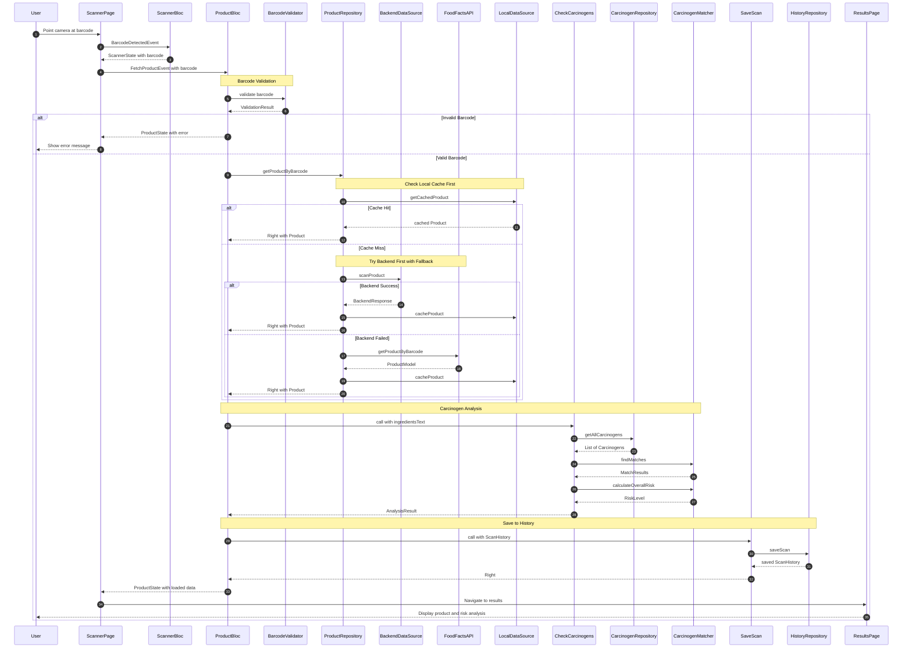
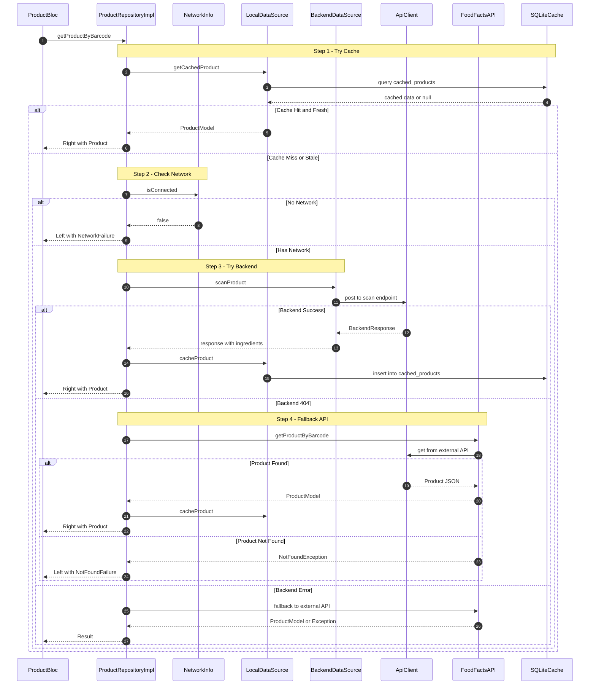
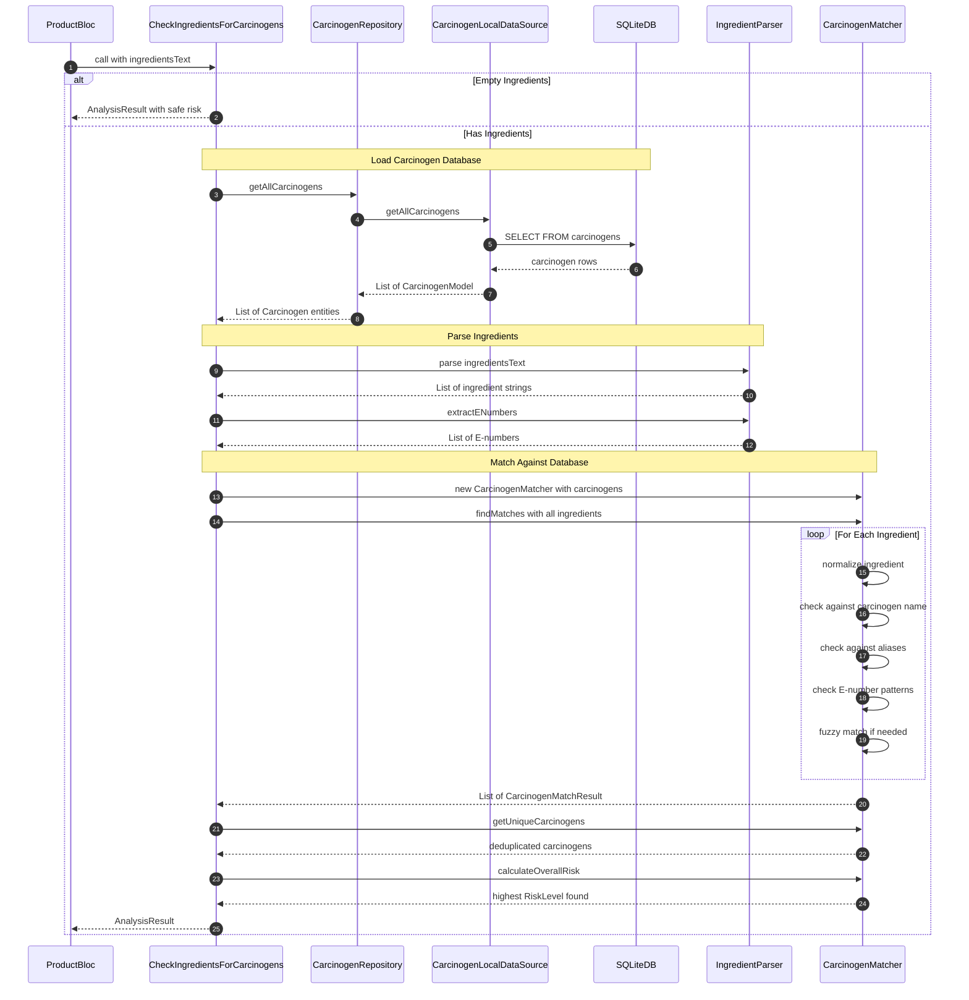
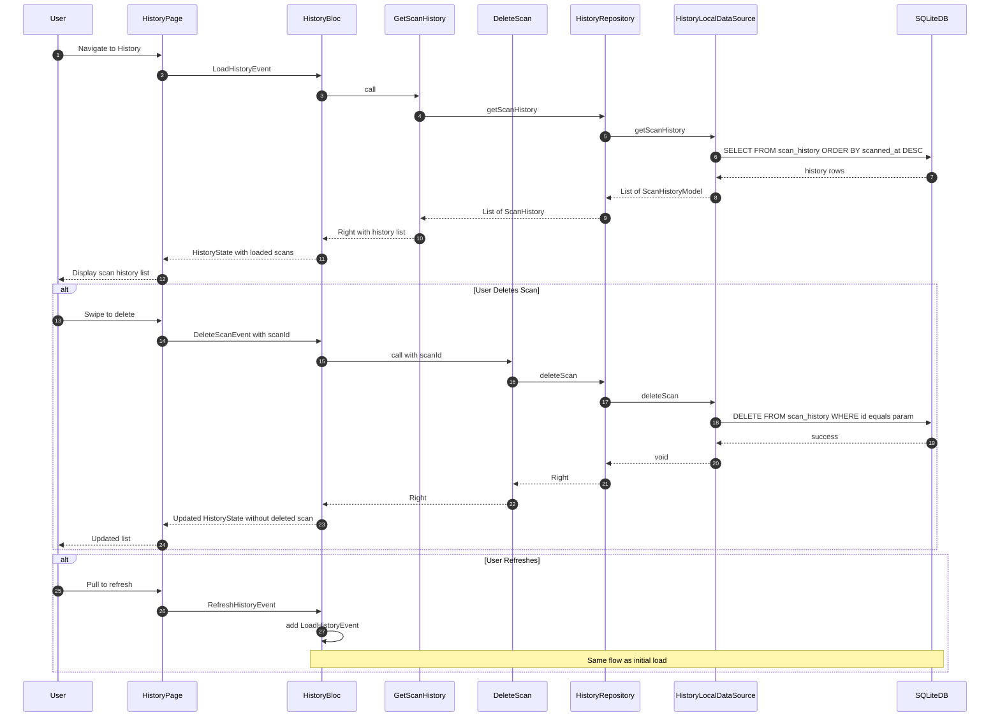
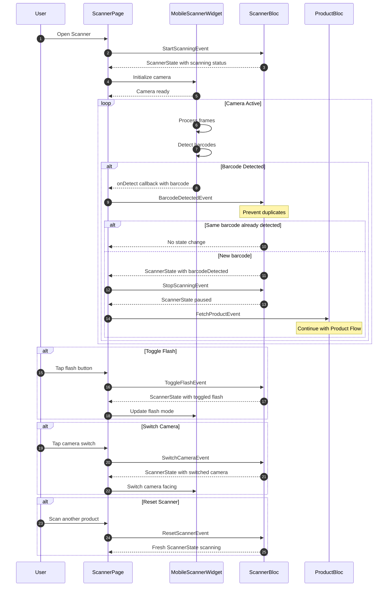
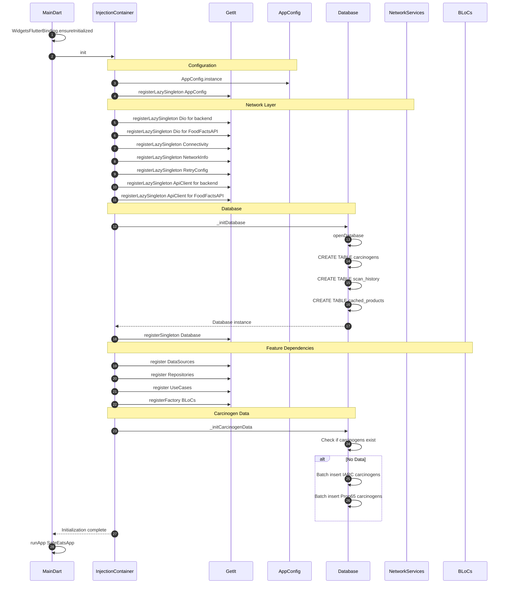
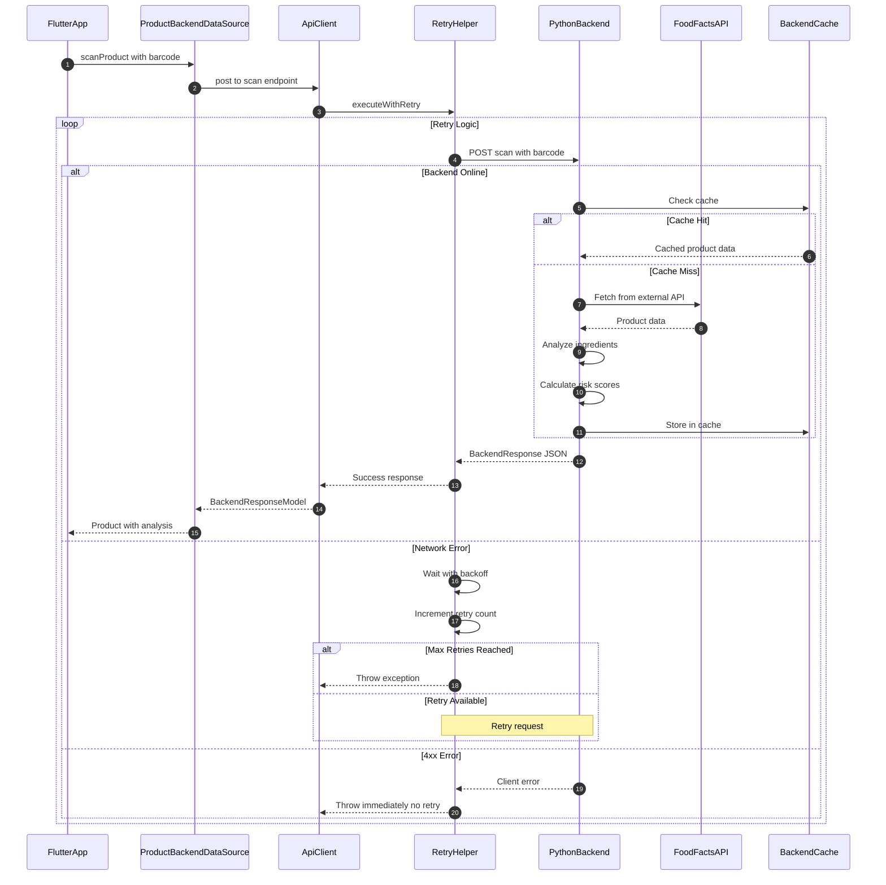

# SafeEats App Flow Sequence Diagrams

This document contains sequence diagrams for all major flows in the SafeEats application.

## 1. Complete Barcode Scan Flow

This shows the end-to-end flow from user scanning a barcode to displaying risk results.

## 2. Product Data Retrieval Flow

Detailed flow of how product data is retrieved with caching and fallback logic.

## 3. Carcinogen Analysis Flow

Flow showing how ingredients are analyzed for potential carcinogens.

## 4. History Management Flow

Flow showing how scan history is loaded, displayed, and managed.

## 5. Scanner Camera Flow

Flow showing the barcode scanning camera interaction.

## 6. App Initialization Flow

Flow showing how the app initializes and sets up dependencies.

## 7. Backend API Integration Flow

Flow showing communication with the Python FastAPI backend.

## Legend

| Symbol | Meaning |
|--------|---------|
| `->>`  | Synchronous call |
| `-->>` | Response or Return |
| `alt`  | Alternative paths |
| `loop` | Repeated action |
| `Note` | Additional context |

## Risk Level Values

| Level | Value | Description |
|-------|-------|-------------|
| safe | 0 | No carcinogens detected |
| low | 1 | IARC Group 3 or minimal concern |
| medium | 2 | IARC Group 2B or moderate concern |
| high | 3 | IARC Group 2A or high concern |
| critical | 4 | IARC Group 1 - Known carcinogen |