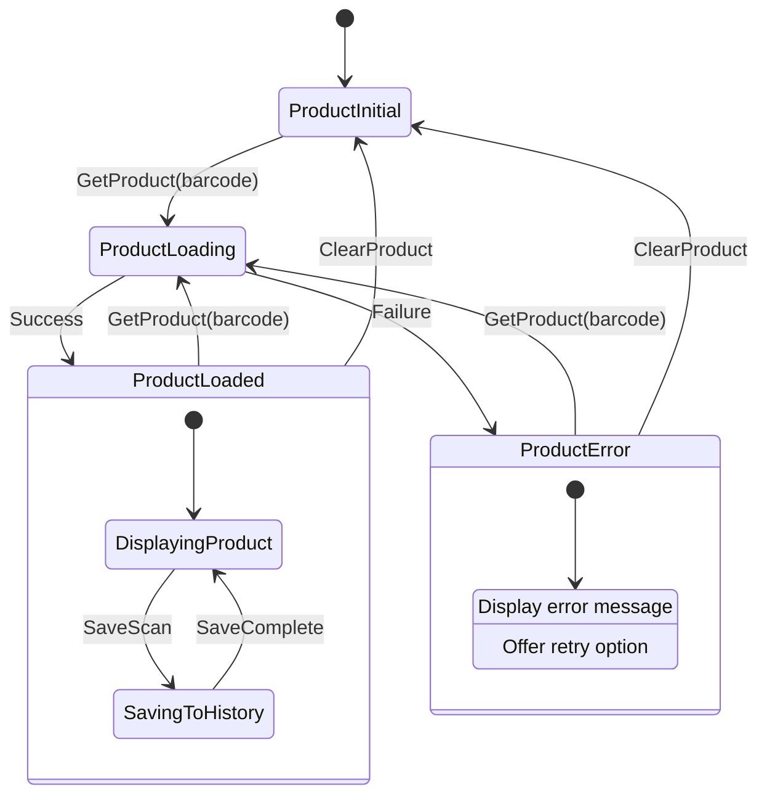
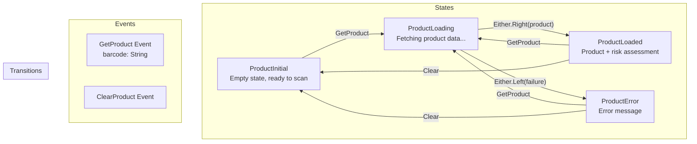
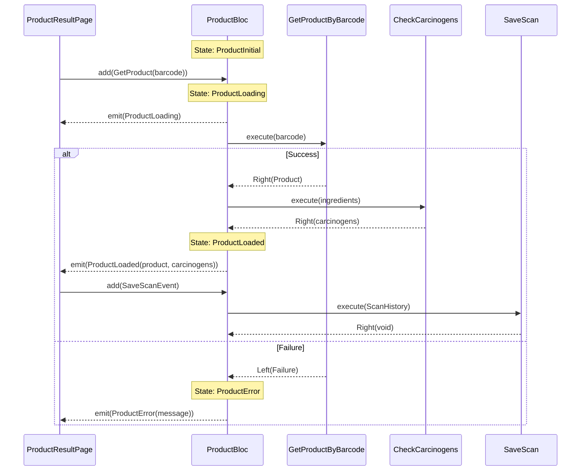

# State Diagram: ProductBloc

This diagram shows the state machine for the ProductBloc, which handles product loading and risk assessment.



## State Descriptions



## Event-State Flow



## BLoC Implementation Details

### Events

```dart
// Base event class
abstract class ProductEvent extends Equatable {
  const ProductEvent();
}

// Get product by barcode
class GetProduct extends ProductEvent {
  final String barcode;
  const GetProduct(this.barcode);
  
  @override
  List<Object> get props => [barcode];
}

// Clear current product
class ClearProduct extends ProductEvent {
  const ClearProduct();
  
  @override
  List<Object> get props => [];
}
```

### States

```dart
// Base state class
abstract class ProductState extends Equatable {
  const ProductState();
}

// Initial empty state
class ProductInitial extends ProductState {
  const ProductInitial();
  
  @override
  List<Object> get props => [];
}

// Loading state
class ProductLoading extends ProductState {
  const ProductLoading();
  
  @override
  List<Object> get props => [];
}

// Loaded with product and risk assessment
class ProductLoaded extends ProductState {
  final Product product;
  final List<Carcinogen> detectedCarcinogens;
  final RiskLevel overallRisk;
  
  const ProductLoaded({
    required this.product,
    required this.detectedCarcinogens,
    required this.overallRisk,
  });
  
  @override
  List<Object> get props => [product, detectedCarcinogens, overallRisk];
}

// Error state
class ProductError extends ProductState {
  final String message;
  
  const ProductError(this.message);
  
  @override
  List<Object> get props => [message];
}
```

### BLoC Logic

```dart
class ProductBloc extends Bloc<ProductEvent, ProductState> {
  final GetProductByBarcode getProductByBarcode;
  final CheckIngredientsForCarcinogens checkIngredientsForCarcinogens;
  final SaveScan saveScan;

  ProductBloc({
    required this.getProductByBarcode,
    required this.checkIngredientsForCarcinogens,
    required this.saveScan,
  }) : super(const ProductInitial()) {
    on<GetProduct>(_onGetProduct);
    on<ClearProduct>(_onClearProduct);
  }

  Future<void> _onGetProduct(
    GetProduct event,
    Emitter<ProductState> emit,
  ) async {
    emit(const ProductLoading());
    
    // 1. Get product
    final productResult = await getProductByBarcode(event.barcode);
    
    await productResult.fold(
      (failure) async {
        emit(ProductError(_mapFailureToMessage(failure)));
      },
      (product) async {
        // 2. Check for carcinogens
        final ingredientNames = product.ingredients.map((i) => i.name).toList();
        final carcinogenResult = await checkIngredientsForCarcinogens(ingredientNames);
        
        await carcinogenResult.fold(
          (failure) async {
            emit(ProductError(_mapFailureToMessage(failure)));
          },
          (carcinogens) async {
            // 3. Calculate overall risk
            final overallRisk = _calculateOverallRisk(carcinogens);
            
            // 4. Emit loaded state
            emit(ProductLoaded(
              product: product,
              detectedCarcinogens: carcinogens,
              overallRisk: overallRisk,
            ));
            
            // 5. Save to history
            await _saveToHistory(product, carcinogens, overallRisk);
          },
        );
      },
    );
  }
}
```

## UI State Mapping

| State | UI Display |
|-------|------------|
| ProductInitial | Empty screen or scan prompt |
| ProductLoading | Loading spinner with message |
| ProductLoaded | Product details, ingredient list, risk indicators |
| ProductError | Error message with retry button |